# emqx-test
## MQTT环境搭建

测试环境使用wsl2 安装 MOTT。细节如下：

1. **安装以及使用wsl**

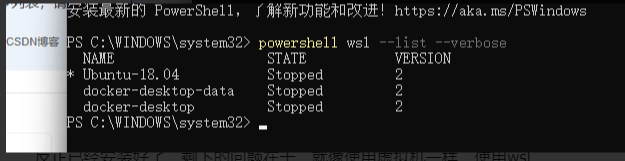

2. 安装MQTT

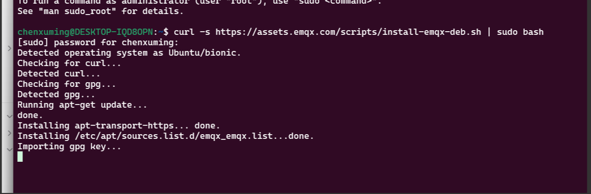

3. 启动MQTT 可视化平台

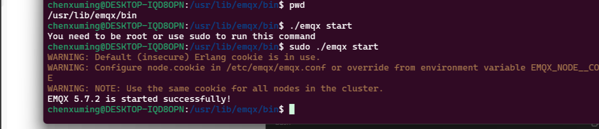

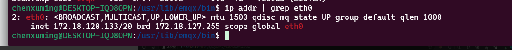

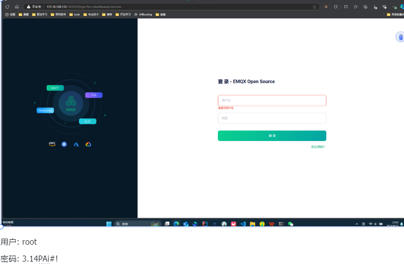

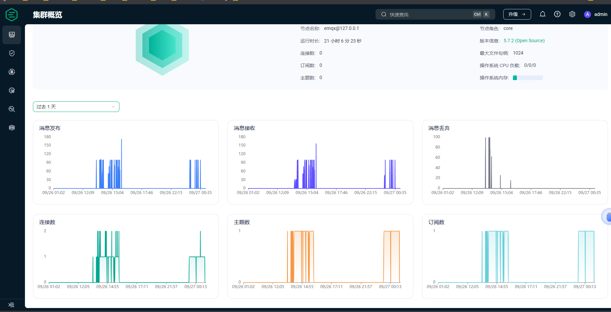

## 接口设计

restful 接口设计为 GET /messages/calculation?startTime={startTime}&endTime={endTime}

## 软件设计

本项目基于maven +  原生Java 实现简单的消费者生产者模型。

1. constant: 保存了一些公共配置信息： 比如主题，MQTT Broker 地址等。
2. consumer: 保存了和消费者相关的类。包括 主程序， 消息类，以及消息统计维护类。
3. datastruct:  保存了 自定义数据结构。 基于自定义实现跳表，来维护各种消息信息。
4. producer: 保存了生产者

### 消息生产者：

生产者连接到客户端，发布消息。详见代码 Producer.java

为了容易测试：上述测试代码中，将时间由Unix时间戳改为一个随机的0 ， 60 的时间，同时定义为秒钟。

## 消息消费者

1. 维护消息

通过跳表数据结构： 维护了所有的消息节点。可以在 Sum(消息总数的复杂度之内)复杂度之内查询。 log(N) 的复杂度之内完成消息的插入。同时使用读写锁优化了并发场景的插入，查询。

2. 查询服务

应用监听了GET /messages/calculation?startTime={startTime}&endTime={endTime}

## 测试

1. 随机发送了 100条消息

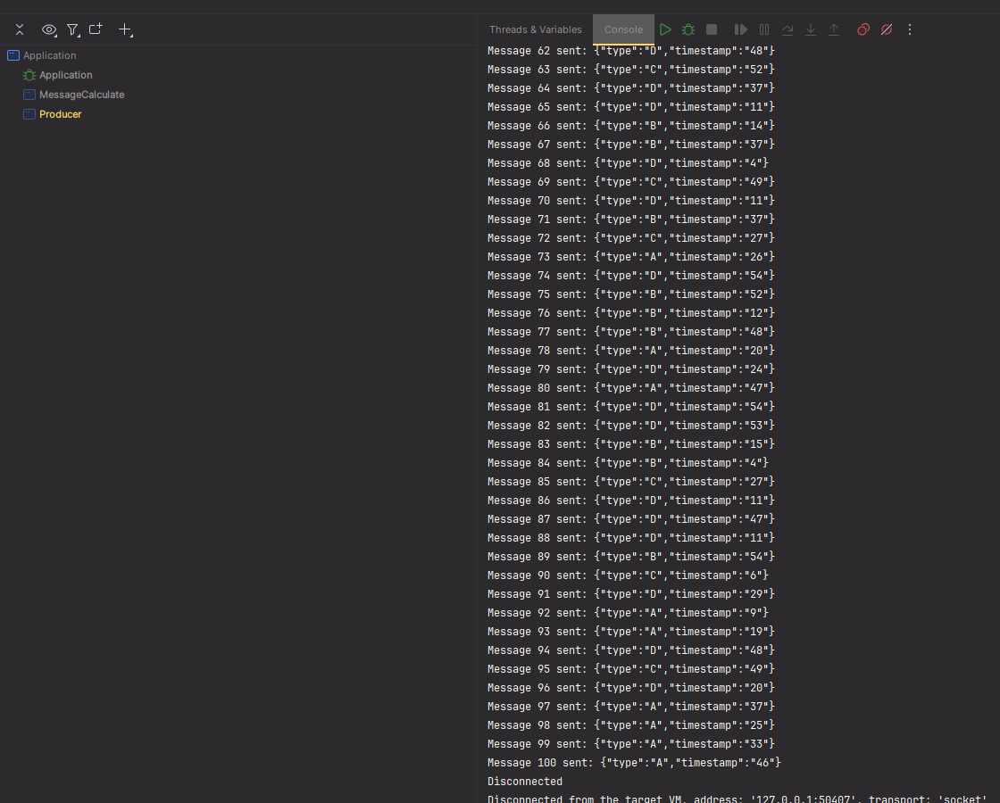

2. 消费者接收基本情形如下：

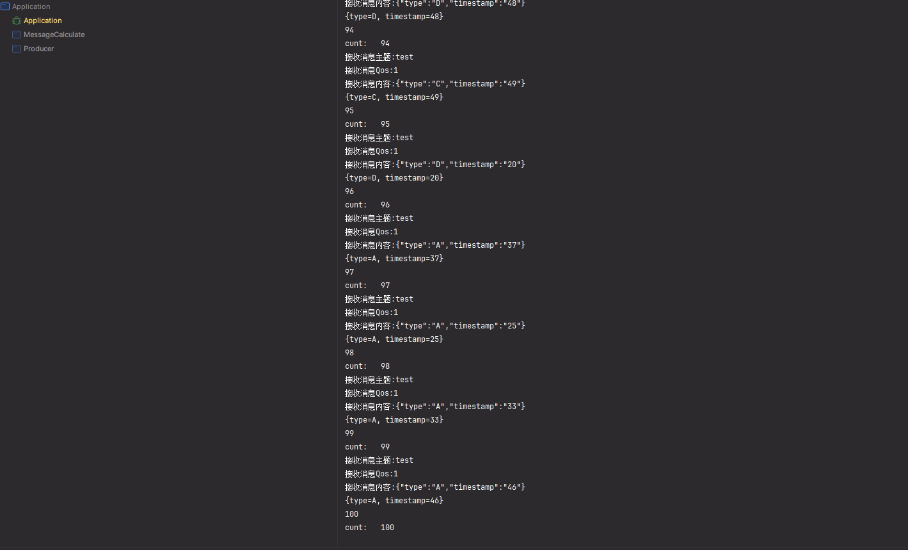

如上成功将所有消息订阅接收。

3. 使用接口测试正确性
   1. 【0， 60】

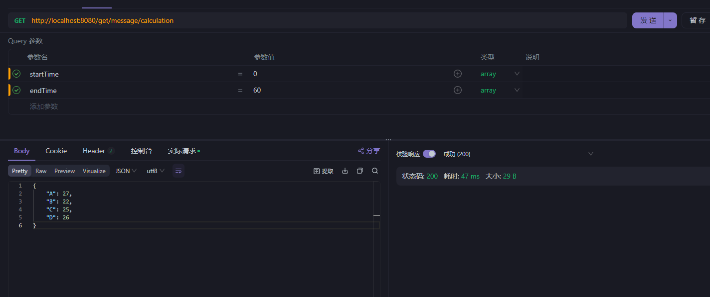

2. 【0，30】

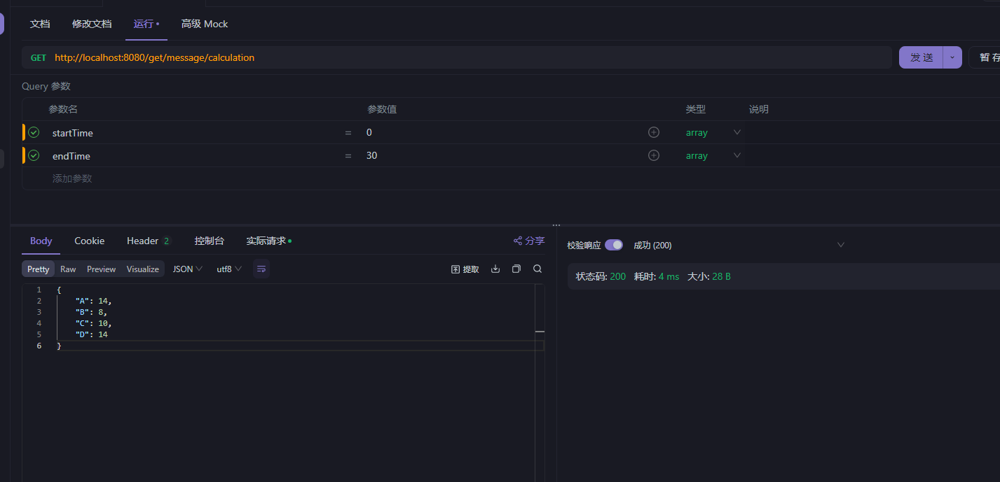

3. 【31，60】

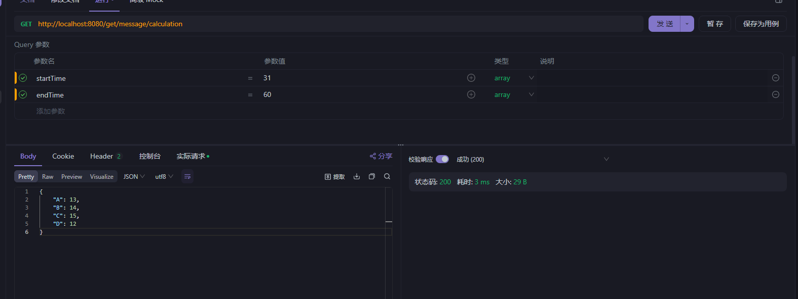

基本可以检验出互斥性。

**考虑更小规模、清晰的测试示例**

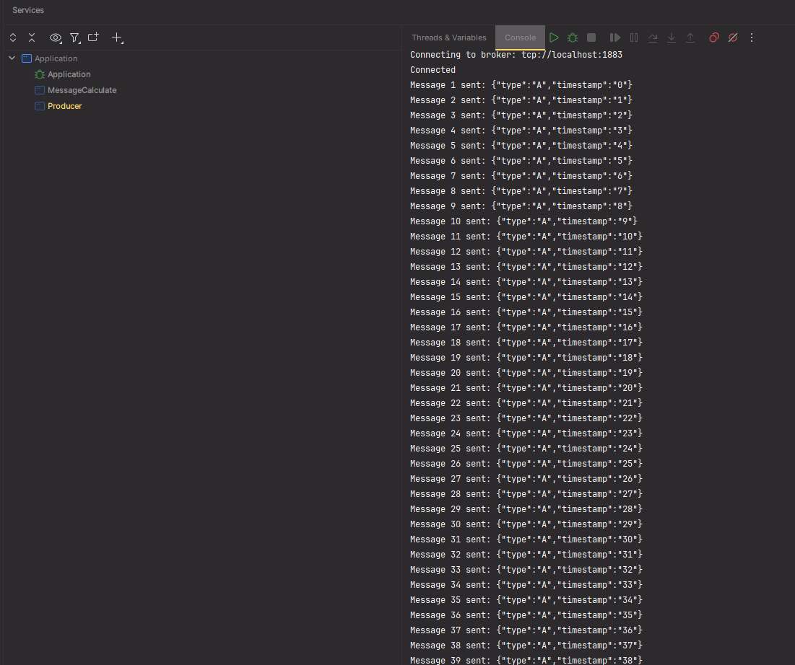

测试情况如下

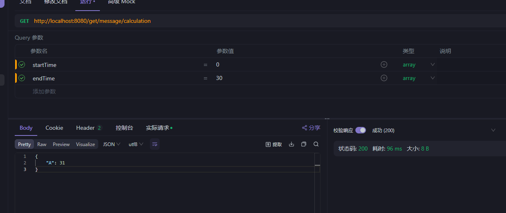

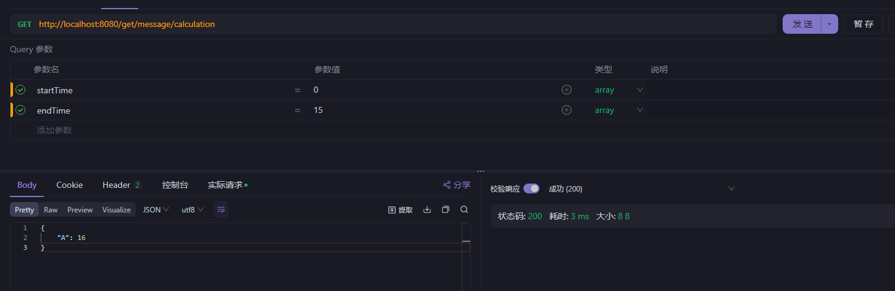

综上，简单样例下可以满足正确性
